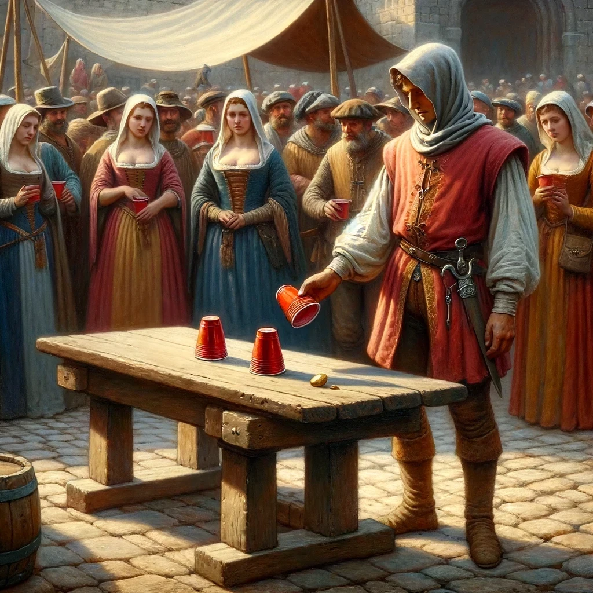

# Reconstructed Object Tracking - Polish AI Olympiad I

This repository is a reconstructed reference solution for the first-stage Object Tracking task in the Polish Artificial Intelligence Olympiad.

The task supplied detected cup bounding boxes for every frame and asked for the final left-to-right identity order after a sequence of swaps.
The implementation uses motion-aware bipartite association: it predicts each track's next center from its velocity, assigns detections globally with an exhaustive minimum-cost permutation for three objects, and reports track identities ordered by final horizontal position.



*Task illustration from the official Polish AI Olympiad I notebook.*

## Method

This is a small, exact instance of the tracking-by-detection / data-association problem
(cf. SORT-style trackers): given per-frame bounding boxes with no identity labels, recover
consistent object identities across time. Identities are anchored once, at frame 0, by sorting
the three detections left-to-right (the task's own definition of cup order). For every
subsequent frame, each track's center is extrapolated with a constant-velocity motion model,
`predicted_t = center_{t-1} + velocity_{t-1}` (a first-order predictor, i.e. a Kalman filter with
the uncertainty/update machinery stripped out), and detections are assigned to tracks by solving
the resulting 3x3 bipartite assignment problem — minimizing total L2 distance between predicted
and detected centers — for which the Hungarian algorithm is the standard general-purpose solver.
With only 3 objects, exhaustively enumerating all `3! = 6` permutations and keeping the cheapest
is exact and simpler than invoking a dedicated assignment solver, while remaining equivalent to
what Hungarian would return.

The constant-velocity prediction step is what makes this robust rather than merely correct on
non-crossing frames: a memoryless nearest-detection matcher degenerates exactly when two cups'
paths cross (both detections become nearly equidistant from both stale positions), which is
precisely when a three-cup shell game is designed to happen. Extrapolating along each track's
recent velocity keeps the predicted position on the correct side of a crossing, resolving the
assignment correctly through the ambiguity. The evaluation metric (`exact_match`) is strict full-
sequence identity match — a single wrong assignment anywhere fails the whole video — which is why
motion-aware association, rather than per-frame nearest-neighbor matching, is necessary for the
50/50 result reported below.

## Quick start

```bash
python scripts/download_data.py
python -m src.evaluate data/valid_data/level_1
python -m unittest discover -s tests -v
```

## Validation

The reconstructed tracker correctly solves 50 of 50 sequences in the official public level 1 validation set.
That is 100% exact-match accuracy on the published validation data.
No hidden-test or leaderboard result is claimed.
See `SOLUTION.md` for the algorithm and evaluation protocol.

## Provenance

The original Polish task notebook is retained as `notebooks/original_submission.ipynb`.
`docs/task_en.md` is an English task summary.
